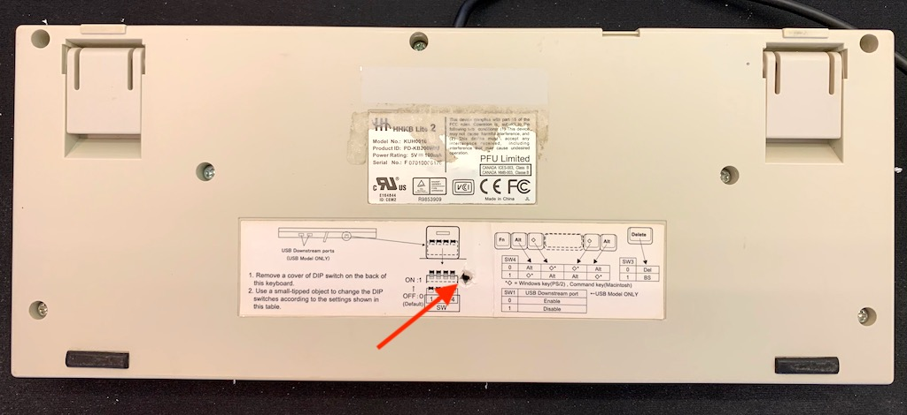
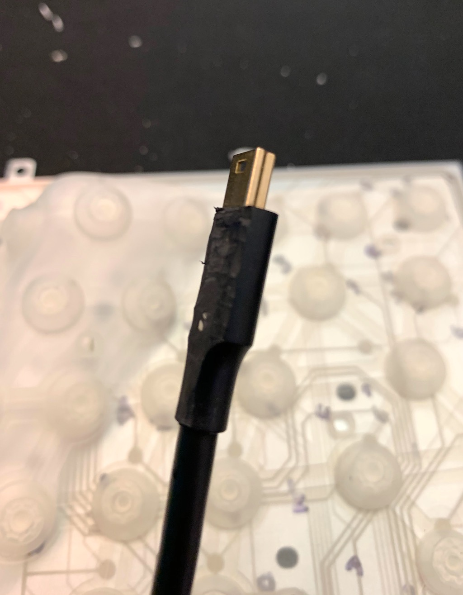
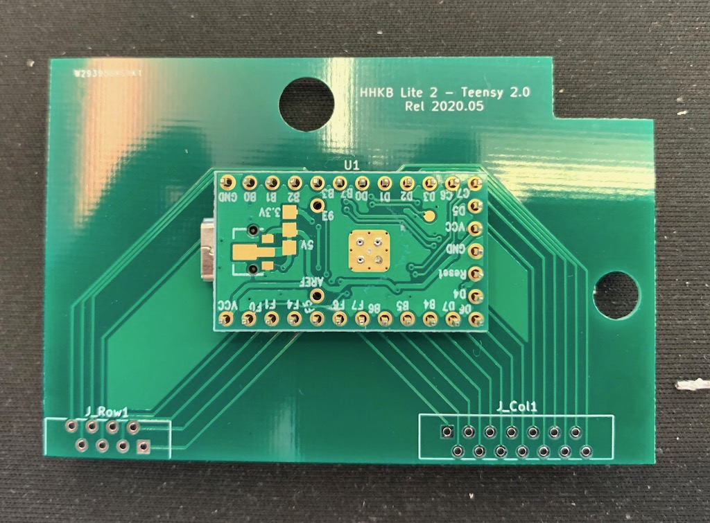
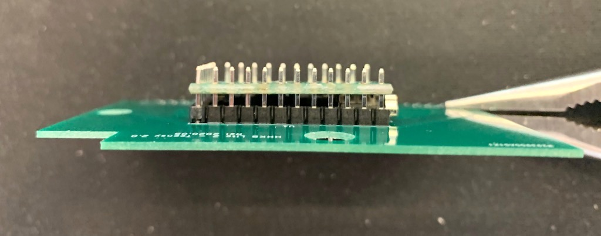
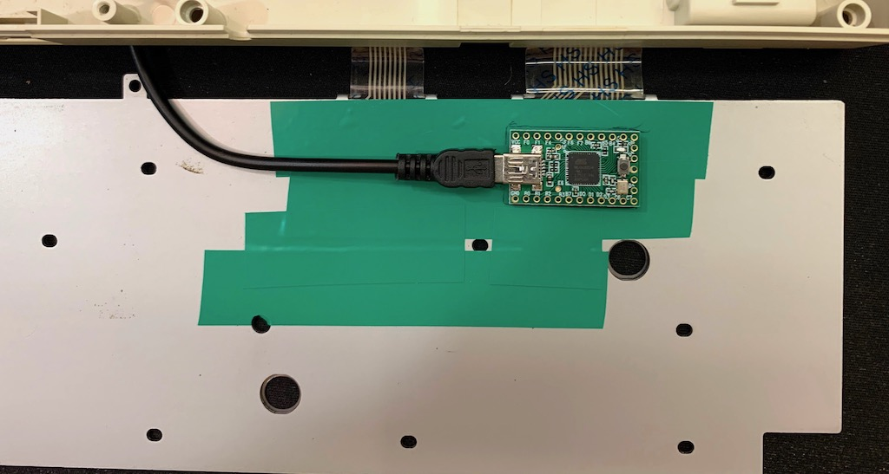

# Teensy 2.0 replacement controller board for HHKB Lite 2

This is a QMK-compatible replacement controller for the [HHKB Lite
2](https://deskthority.net/wiki/HHKB_Lite), identified by model
numbers PD-KB200W/U or PD-KB200B/U.

This Lite version of the HHKB is a membrane keyboard and not exactly
popular compared to more expensive Professional versions that use
Topre switches. But the wiring is simple and is a good first project
for modding commercial keyboards.

This replacement uses a [Teensy
2.0](https://www.pjrc.com/store/teensy.html), which is cheap, has
plenty of pins, and works well with the [QMK
firmware](https://qmk.fm/). The entire controller board is replaced,
so you will lose the built-in USB hub. You will gain all the benefits
of the powerful QMK and similar Teensy-supported firmware.

## Steps

1. Acquire/fabricate the PCB.
2. Get the parts
3. Disassemble the keyboard.
4. Modify the USB cable you will be using and insert it into the Teensy.
5. Solder the components on to the board. Take care to leave enough
   room for the USB cable when soldering the Teensy.
6. Reconnect the flex cables and insulate the backplate.
7. Flash your firmware and test your keyboard.
8. Reassemble the shell.

### PCB fabrication

The fabrication-ready files are in `plots/`. Just send them to your
preferred fab. It is a pretty standard 1.6mm PCB with conservative via
and track parameters that just about any shop can handle.

### Parts

* 1 [Teensy 2.0](https://www.pjrc.com/store/teensy.html)
* 1 Molex Easy-On 14-pin 1.25mm pitch FFC connector 39-53-2145
* 1 Molex Easy-On 8-pin 1.25mm pitch FFC connector 39-53-2085
* 1/10" pitch thru-hole headers for Teensy
* (White?) Mini-USB cable for Teensy

The USB cable you get should have plastic plugs, because you will have
to shave them down later.

### Disassembly

The keyboard is held together by a few screws. Don't forget the screw
hiding under the label. When the shell is open, there are also further
one screw holding down the metal backplate and one screw each for
the PCBa.

The USB cable can be removed from the shell but does not need to be
detached from the PCB. We will be using another USB cable instead.

The flex cables can be eased out gently. There is no latching
mechanism.

### Modify the USB cable

The Mini-USB plug that goes to the Teensy needs to be shaved down to
save about 1mm of thickness.

### Soldering the board

My recommended order is:
1. Headers for Teensy on to the board
2. Molex connectors
3. Teensy

The Molex connectors are oriented in opposite directions, with pin 1
(the edge with a little notch) of each connector facing each
other. This is important because the flex cables and connectors are
single sided.

Note that the Teensy should be mounted upside down, on the same side
as the connectors. This is to save a couple of millimeters of space
from the stacked height of the connectors. You may have to trim down
the header pins after you've soldered on the Teensy. The USB cable
should still be able to fit.

### Connect flex cables and insulate the backplate

Connect the flex cables to the PCB. Note the orientation.

The metal backplate should be insulated, at least around the area of
the PCB, to minimize the risk of it shorting the board. I use a few
strips of electrical insulation tape here.

### Flash the firmware and test

Plug in the USB cable to your computer and flash the firmware. There's
a copy of the firmware with the default layout at `hex/hhkblite2.hex`.

Programming is done using [Teensy
Loader](https://www.pjrc.com/teensy/loader.html). Since the Teensy is
mounted upside down and the reset button no longer exposed, you can
short the `RST` and `GND` pins instead.

After a successful initial flash, you can use the `reset` key to enter
flashing mode instead of having to open the keyboard. On my default
configuration, the `reset` key is `Fn` + `Esc`.

After flashing, you should be able to type something. It's easiest to
just put the silicone membrane over the traces and try typing
something.

### Reassembly

The PCB here only uses one of the original PCB mounting screws. Route
the USB cable around the internal strain relief. Don't forget the
screw for the backplate.

You're done!

## PCB details

This is a [KiCad](https://kicad-pcb.org/) project, but you can find
the generated fabrication files in `plots/`. Just send them to your
preferred PCB factory.

The schematics are fairly straightforward, with 8 row pins and 14
column pins:

The PCB layout is likewise simple:

## Firmware

The configuration in `firmware/` can be uploaded to [Keyboard Firmware
Builder](https://kbfirmware.com/) to generate firmware for the
standard US QWERTY layout.

There will be a warning "Not every key has a unique position in the
wiring matrix". This can be ignored and it is due to both `Fn` keys
being wired exactly the same. You should take note of this when
designing your own layouts: it is not possible to assign different
keycodes to each `Fn` key as they are electrically indistinguishable.

The wiring matrix is a bit of a mess, as is typical of membrane
keyboards that do not have diodes to prevent ghosting: the matrix is
designed to minimize ghosting from common key combinations but will
never completely eliminate it.

